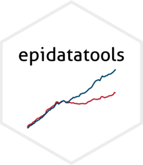

<!-- README.md is generated from README.Rmd. Please edit that file -->

```{r, include = FALSE}
knitr::opts_chunk$set(
  collapse = TRUE,
  comment = "#>",
  fig.path = "man/figures/README-",
  out.width = "100%"
)
```

# epidatatools <a href="https://economic.github.io/epidatatools/"></a>

epidatatools contains functions we find useful at [EPI](https://epi.org/) that don't have exact analogues elsewhere in the R package ecosystem.

## One and two-way cross-tabulations
```{r, message = FALSE}
library(epidatatools)

crosstab(mtcars, cyl)

crosstab(mtcars, cyl, gear)

# weighted counts expressed as column percentages
crosstab(mtcars, cyl, gear, w = mpg, percent = "column")
```

## Join data frames and add a merge status indicator
```{r, message = FALSE}
library(dplyr)

merge_status(band_members, band_instruments, by = "name")
```

## Summarize across several distinct groups
```{r}
summarize_groups(mtcars, cyl|gear|carb, p50 = median(mpg), avg = mean(hp))
```

## Calculate smoothed quantiles
```{r}
p = seq(10, 50, 90)

mtcars |>
  reframe(
    p,
    value = averaged_quantile(mpg, probs = p / 100)
  )
```

## Interpolated quantiles
``` {r}
p = seq(10, 50, 90)

mtcars |> 
  binipolate(mpg, probs = p/100, bin_size = 0.25)
```

## Installation
Install the latest version from R-Universe:
```{r, eval = FALSE}
install.packages("epidatatools", repos = c("https://economic.r-universe.dev", "https://cloud.r-project.org"))
```

